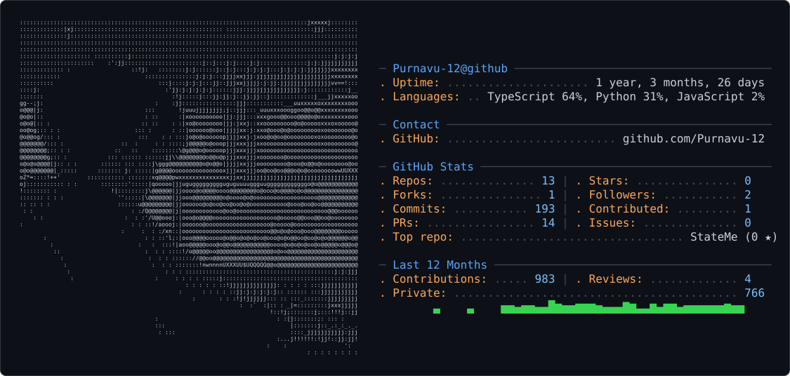

<picture>
  <source media="(prefers-color-scheme: dark)" srcset="dark_mode.svg" />
  <source media="(prefers-color-scheme: light)" srcset="light_mode.svg" />
  
</picture>

Shipping systems > building demos.

I'm a 2nd-year undergrad obsessed with the mechanics of production-grade software. Anyone can write a script, but I want to know how a system behaves when the state is distributed, the network is unreliable, and the users are real.

**Stacking knowledge in:**

Distributed Systems | Agentic AI & MCP | Cloud & Containers | CI/CD Pipelines | Applied DSA | Product Engineering

If it has complex failure modes and needs to scale, I want to build it.

**AI / Agents** · LLMs • Agentic AI • MCP • RAG

**Systems & Infrastructure** · PostgreSQL • Docker • Git • GitHub • Linux

**Languages** · C & C++ • Java • Python • FastAPI • Next.js

**[StateMe](https://github.com/Purnavu-12/StateMe)** &nbsp;·&nbsp; <samp>next.js, typescript, ai</samp> 
A multi-tenant status page and incident management SaaS. Teams publish public status pages, manage incidents, send subscriber notifications, and generate AI postmortems — all in one place.

**[bobman-mcp](https://github.com/Purnavu-12/bobman-mcp)** &nbsp;·&nbsp; <samp>typeScript</samp> 
Closed-loop engineering MCP whose value is the *loop itself* — the agent only becomes safer and more deliberate when there is a stateful orchestrator on the other side of stdio.

**[RAPID](https://github.com/Purnavu-12/RAPID)** &nbsp;·&nbsp; <samp>typeScript</samp> 
A live, event-driven revenue recovery platform for merchants using Razorpay.

**[Life-log](https://github.com/Purnavu-12/Life-log)** &nbsp;·&nbsp; <samp>typeScript</samp> 
Transform fleeting thoughts into structured, searchable memories. Captures audio, transcribes, extracts insights, integrates with calendar and email.

&nbsp;
&nbsp;

